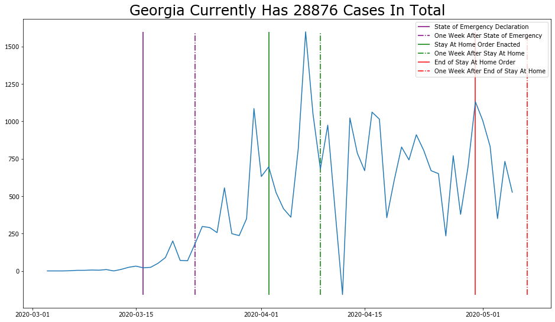

# US COVID-19 Data

In a weak attempt at finding some silver-lining during these times self-quarantine and stir-crazy infused boredom, I went looking for a good coronavirus dataset with which to practice my newly acquired data science skills. And, by pure chance, The New York Times began offering that data on their [GitHub](https://github.com/nytimes/covid-19-data) the very next day and has been updating is regularly since.

This data provides information on the spread of Coronavirus is all 50 States, 5 Territories, and Washington DC.

- [Data](https://github.com/nytimes/covid-19-data)
- [License](https://github.com/nytimes/covid-19-data/blob/master/LICENSE)

### Objective

The goal of the analysis is simple. I want to track coronavirus in each state and terrotory on the United States to be able to look for patterns and effects of State Action, like Stay at Home Orders. To accomplish this, I created graphs for different states, marking the point in time that certain actions were taken, and then marking again 7 days later to delay for the incubation period.

While experts have put the [median incubation period at 5.1 days](https://annals.org/aim/fullarticle/2762808/incubation-period-coronavirus-disease-2019-covid-19-from-publicly-reported), I chose to round it up to 7 days to factor in the potential delay between showing symptoms and being confirmed positive. I could not find any official report on how long the delay between showing symptoms and testing positive is, so the choice of 7 days as a delay is just a choice that I made. If there is a more official way to do this, please comment it in the Issues and I will make the changes needed.

### Limitations

While the data used is very likely the best data available at this time, the data is far from perfect. [Testing shortages and tests with low accuracy](https://fivethirtyeight.com/features/there-are-not-enough-covid-19-tests-there-are-also-too-many-covid-19-tests/) are not only preventing a forseeable end the country being shut down, they are making it impossible to have the fully accurate numbers. These limitations will effect the day to day accuracy, but hopefully not the data as a whole.

### The Current State of the Data

The graphs are all made, and the most important ones are now self updating. So every time something of relevance happens, I wait about 10 to 14 days to look at how it effected that states cases. Things like a state lifting restrictions or Easter happening. Since the data is current and ongoing, I'm just trying ot learn what I can.

The code that I use requires no changing when updating with new data from the New York Times, so as data changes over the coming months, I will try to continue updating the graphs.