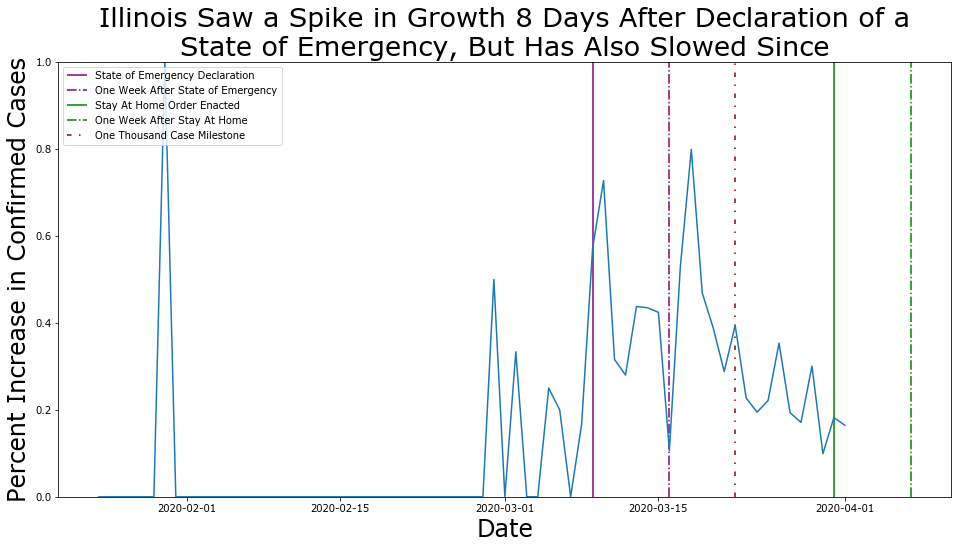

{
 "cells": [
  {
   "cell_type": "markdown",
   "metadata": {},
   "source": [
    "# US COVID-19 Data\n",
    "\n",
    "In a weak attempt at finding some silver-lining during these times self-quarantine and stir-crazy infused boredom, I went looking for a good coronavirus dataset with which to practice my newly acquired data science skills. And, by pure chance, The New York Times began offering that data on their [GitHub](https://github.com/nytimes/covid-19-data) the very next day and has been updating is regularly since.\n",
    "\n",
    "This data provides information on the spread of Coronavirus is all 50 States, 5 Territories, and Washington DC.\n",
    "\n",
    "- [Data](https://github.com/nytimes/covid-19-data)\n",
    "- [License](https://github.com/nytimes/covid-19-data/blob/master/LICENSE)\n",
    "- Data Cloned 4/14/20\n",
    "\n",
    "### Objective\n",
    "\n",
    "The goal of the analysis is simple. I want to see what type of government action is most effective in slowing the spread of the coronavirus. To accomplish this, I created graphs for different states, marking the point in time that certain actions were taken, and then marking again 7 days later to delay for the incubation period.\n",
    "\n",
    "While experts have put the [median incubation period at 5.1 days](https://annals.org/aim/fullarticle/2762808/incubation-period-coronavirus-disease-2019-covid-19-from-publicly-reported), I chose to round it up to 7 days to factor in the potential delay between showing symptoms and being confirmed positive. I could not find any official report on how long the delay between showing symptoms and testing positive is, so the choice of 7 days as a delay is just a choice that I made. If there is a more official way to do this, please comment it in the Issues and I will make the changes needed.\n",
    "\n",
    "### Limitations\n",
    "\n",
    "While the data used is very likely the best data available at this time, the data is far from perfect. First of all [no test is 100% accurate](https://www.livescience.com/covid19-coronavirus-tests-false-negatives.html). Second of all, [not everyone is being tested](https://www.theguardian.com/world/2020/mar/18/coronavirus-testing-us-q-and-a-availability-shortage). These limitations will effect the day to day accuracy, but hopefully not the data as a whole.\n",
    "\n",
    "\n",
    "\n",
    "### The Current State of the Data\n",
    "\n",
    "While I do not have all 56 states/territories/DCs mapped out quite yet, I am trying ot take time every few days to graph out a few more of them. I am looking up the dates of states of emergencies being declared, stay at home orders being given, and will soon be adding stay at home orders being ended, as states begin to do that.\n",
    "\n",
    "The code that I use requires no changing when updating with new data from the New York Times, so as data changes over the coming months, I will try to continue updating the graphs."
   ]
  },
  {
   "cell_type": "markdown",
   "metadata": {},
   "source": []
  },
  {
   "cell_type": "markdown",
   "metadata": {},
   "source": []
  },
  {
   "cell_type": "markdown",
   "metadata": {},
   "source": []
  },
  {
   "cell_type": "markdown",
   "metadata": {},
   "source": []
  },
  {
   "cell_type": "markdown",
   "metadata": {},
   "source": []
  },
  {
   "cell_type": "markdown",
   "metadata": {},
   "source": []
  },
  {
   "cell_type": "markdown",
   "metadata": {},
   "source": []
  },
  {
   "cell_type": "markdown",
   "metadata": {},
   "source": []
  }
 ],
 "metadata": {
  "kernelspec": {
   "display_name": "Python 3",
   "language": "python",
   "name": "python3"
  },
  "language_info": {
   "codemirror_mode": {
    "name": "ipython",
    "version": 3
   },
   "file_extension": ".py",
   "mimetype": "text/x-python",
   "name": "python",
   "nbconvert_exporter": "python",
   "pygments_lexer": "ipython3",
   "version": "3.7.3"
  }
 },
 "nbformat": 4,
 "nbformat_minor": 2
}
